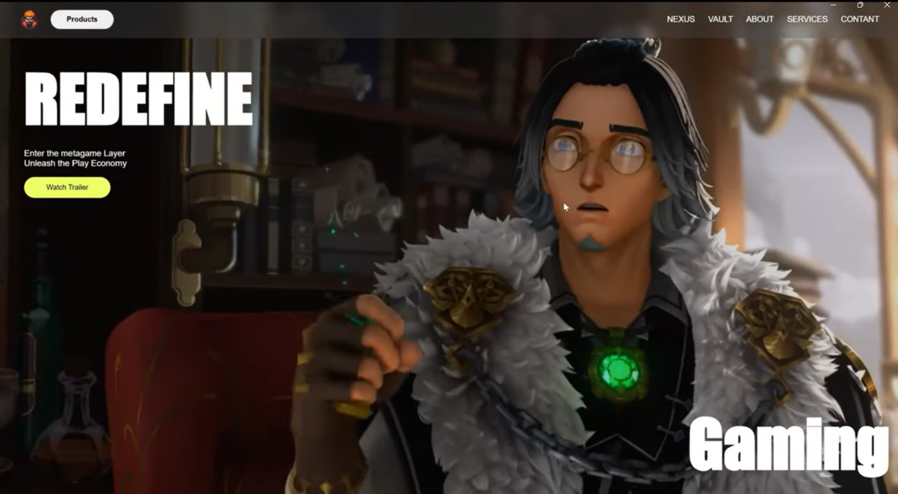
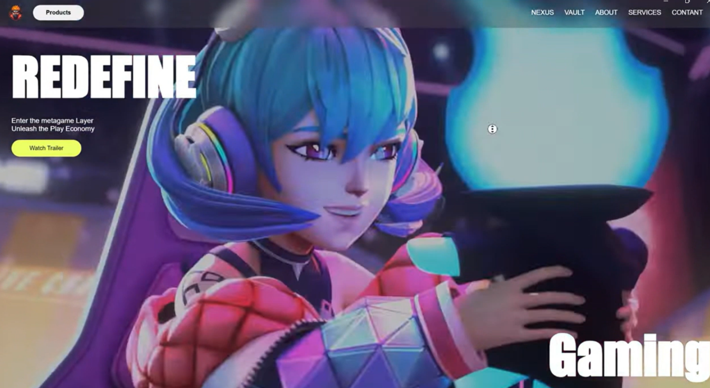

<p align="center">
  
</p>

<h1 align="center">🎮 Gaming Website Landing Page</h1>

<p align="center">
  A modern, immersive gaming landing page built using HTML, CSS, and JavaScript.
  <br>
  <b>Experience metaverse vibes with smooth transitions and dynamic video content.</b>
</p>


---

## ✨ Features

- 🎥 Fullscreen video background
- 🔁 Dynamic video switching (Next button)
- 🎨 Gradient animated text
- 🧱 Clean layout using Flexbox & CSS Grid
- 📱 Responsive for all devices

---

## 🛠️ Built With

- HTML5
- CSS3
- JavaScript (Vanilla)

---

## 🚀 Getting Started

1. **Clone the repository**
   ```bash
   git clone https://github.com/ShatyamYograj/gaming-website.git
   cd gaming-website
Open index.html in your browser

📁 Folder Structure
bash
Copy
Edit
gaming-website/
├── index.html
├── style.css
├── app.js
├── /videos
│   ├── hero-1.mp4
│   ├── hero-2.mp4
│   └── ...
├── /img
│   ├── logo.png
│   └── banner.png (optional)
📸 Screenshot
Add a screenshot of your website below:

<p align="center">  </p>
📬 Contact
Feel free to connect or give feedback:

GitHub: @ShatyamYograj

Email: shatyamyograj11@gmail.com

📄 License
Licensed under the MIT License.

⭐ Don't forget to star this repo if you like it!
